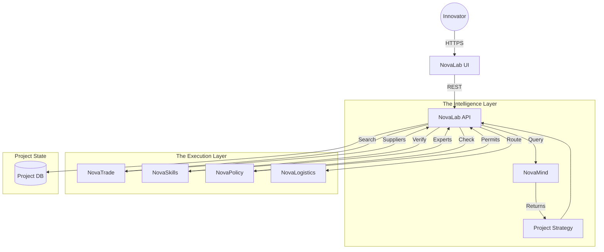

# 🧪 NovaLab

> **The Innovation Engine for the Circular Economy.**
> A unified workspace to design, staff, and launch circular business models.

[](https://www.google.com/search?q=https://github.com/novaeco-tech/product-nova-lab/actions)
[](https://opensource.org/licenses/MIT)
[](https://www.google.com/search?q=https://lab.novaeco.tech)

**NovaLab** (formerly NovaHub) is the user interface for human collaboration within the NovaEco. While Sectors manage *data* (e.g., bin levels, crop yields) and Enablers manage *infrastructure* (e.g., payments, AI), **NovaLab** manages **Intent**.

It uses a "Wizard" interface to decompose complex goals (e.g., "I want to start a textile recycling loop") into atomic, executable tasks across the ecosystem.

-----

## 🎯 Value Proposition

The circular economy is complex. A single project might require legal permits (`NovaPolicy`), logistics (`NovaLogistics`), and material sourcing (`NovaTrade`). **NovaLab** abstracts this complexity:

1.  **The "Loop Wizard":** A step-by-step guide that turns a vague idea into a structured project plan.
2.  **Matchmaking:** Automatically finds partners (suppliers, logistics, buyers) for your project using `NovaMind`.
3.  **Project Command Center:** Tracks the status of physical flows, contracts, and impact metrics in one dashboard.

-----

## 🏗️ Architecture (The Orchestrator)

NovaLab acts as a **Super-Client**. It does not own low-level data; instead, it orchestrates interactions between the user and the underlying Enablers.



### Key Integrations

  * **[NovaMind](https://www.google.com/search?q=https://mind.novaeco.tech):** The "Brain" that analyzes the user's intent text (e.g., "Recycle coffee grounds") and suggests a viable business model (e.g., "Mushroom Farming Input").
  * **[NovaTrade](https://www.google.com/search?q=https://trade.novaeco.tech):** Used to find partners and generate smart contracts for the project.
  * **[NovaSkills](https://www.google.com/search?q=https://skills.novaeco.tech):** Used to hire certified experts (lawyers, engineers) needed for the project.
  * **[NovaPolicy](https://www.google.com/search?q=https://compliance.novaeco.tech):** Checks the project plan against local regulations (e.g., waste transport permits).

-----

## ✨ Key Features

### 1\. The Innovation Wizard

A structured intake flow for new circular ventures.

  * **Input:** "I have 5 tons of orange peels per month in Seville."
  * **Process:** `NovaMind` analyzes the input against the database of known "Waste-to-Value" pathways.
  * **Output:** "Suggested Project: Pectin Extraction or Bio-gas."

### 2\. The Partner Matcher

Think of it as "LinkedIn for the Supply Chain."

  * If you select "Pectin Extraction," NovaLab automatically queries **NovaTrade** for:
      * Buyers of Pectin.
      * Logistics providers (`NovaLogistics`) who can transport bio-waste.
      * Equipment suppliers (`NovaMake`) for extraction machinery.

### 3\. The "Launchpad" Dashboard

Once a project is active, this dashboard aggregates real-time data.

  * **Financials:** Escrow status via `NovaFin`.
  * **Impact:** Real-time CO₂ savings calculated by `NovaBalance`.
  * **Logistics:** Live map of truck movements via `NovaLogistics`.

-----

## 🚀 Getting Started

We use **DevContainers** to provide a consistent development environment.

### Prerequisites

  * Docker Desktop
  * VS Code (with Remote Containers extension)

### Installation

1.  **Clone the repo:**
    ```bash
    git clone https://github.com/novaeco-tech/product-nova-lab.git
    cd product-nova-lab
    ```
2.  **Open in VS Code:**
      * Run `code .`
      * Click **"Reopen in Container"** when prompted.
3.  **Start the Product:**
    The container automatically installs dependencies. To start the dev server:
    ```bash
    make dev
    ```
      * **Frontend:** http://localhost:3000
      * **BFF API:** http://localhost:8000/docs

-----

## 📂 Repository Structure

This is a Monorepo containing the frontend, the BFF, and a specialized worker for project state sync.

```text
product-nova-lab/
├── api/                # Python/FastAPI Backend (The Orchestrator)
│   ├── src/
│   │   ├── wizard/     # Logic for the "Innovation Wizard" state machine
│   │   ├── graph/      # GraphQL resolver for project dependencies
│   │   └── clients/    # gRPC clients for Enablers
├── app/                # React/Next.js Frontend (The Workspace)
│   ├── src/
│   │   ├── flow/       # React Flow components for project mapping
│   │   └── dashboard/  # Project management UI
├── worker-sync/        # Background Service
│   └── src/            # Syncs project status updates from NovaTrade/Logistics
├── website/            # Product Documentation (Docusaurus)
└── tests/              # Integration tests
```

-----

## 🧪 Testing

  * **Wizard Logic:** `make test-wizard` (Unit tests for the state machine).
  * **Integration:** `make test-int` (Simulates a full user journey: Create Project -\> Find Partner -\> Sign Contract).

-----

## 🤝 Contributing

We specifically need help with **Wizard Templates** (defining new circular business models) and **UI/UX Designers** for the project mapping tool.
See [CONTRIBUTING.md](https://www.google.com/search?q=../.github/CONTRIBUTING.md) for details.

**Maintainers:** `@novaeco-tech/maintainers-product-nova-lab`